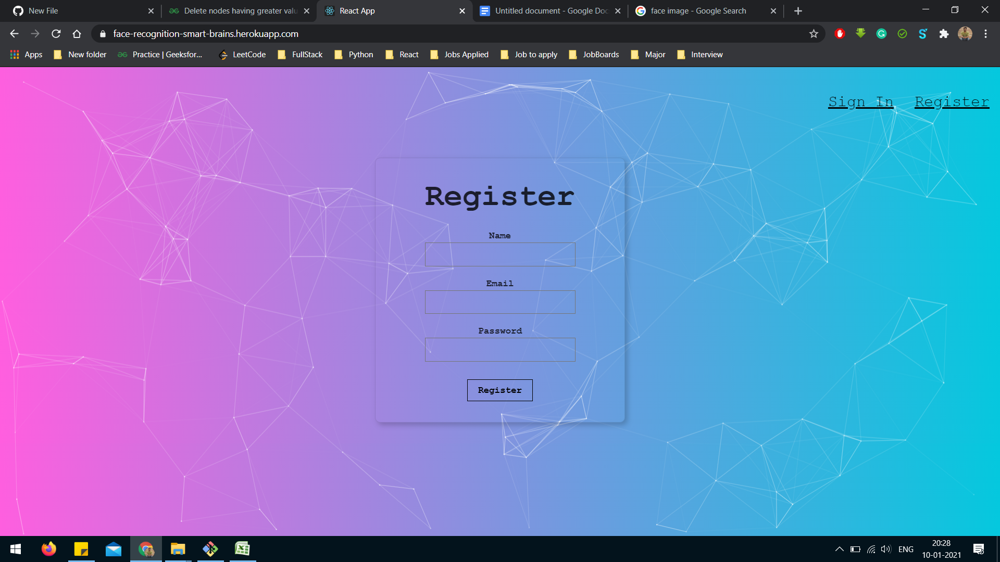
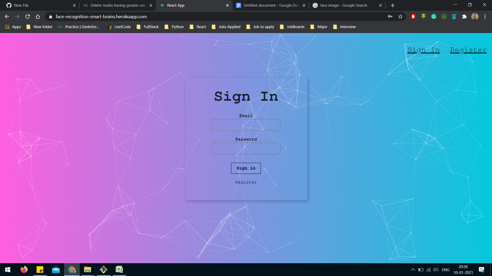
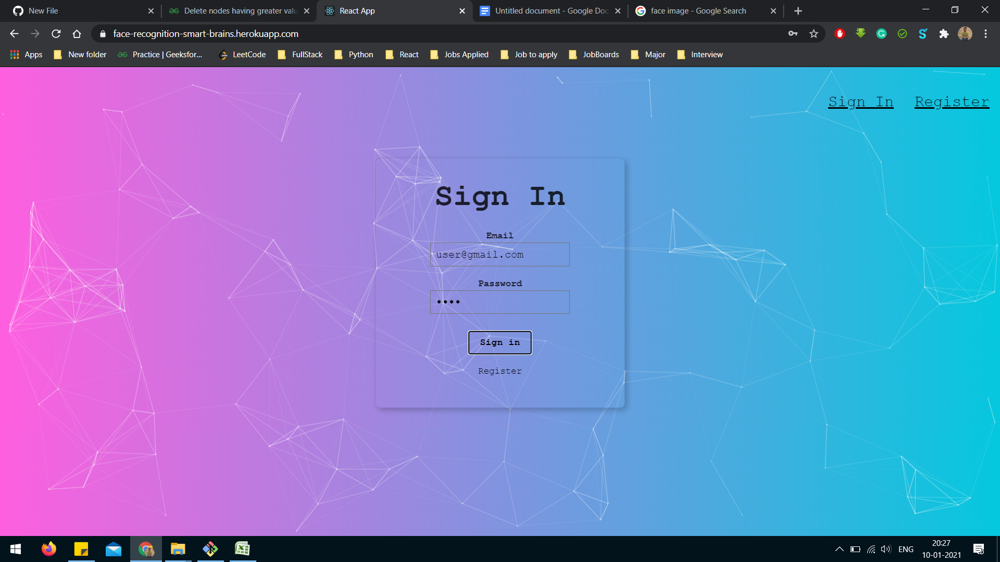
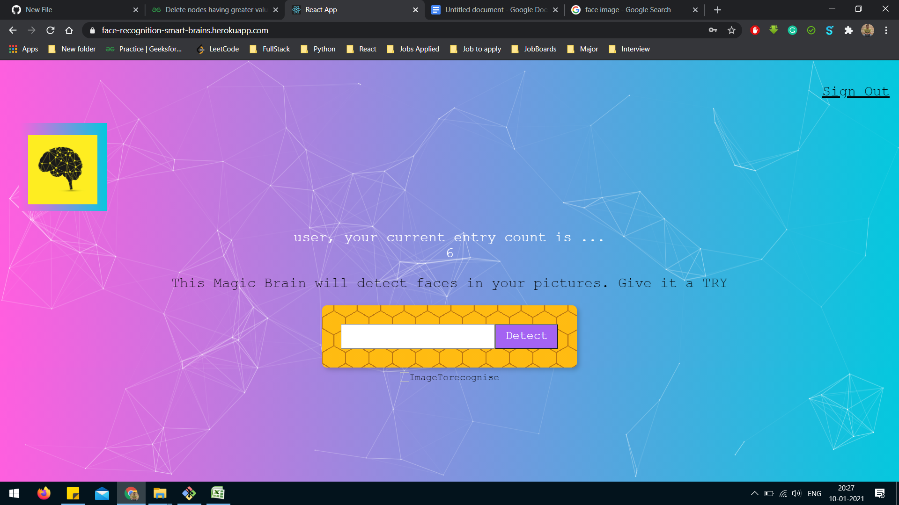
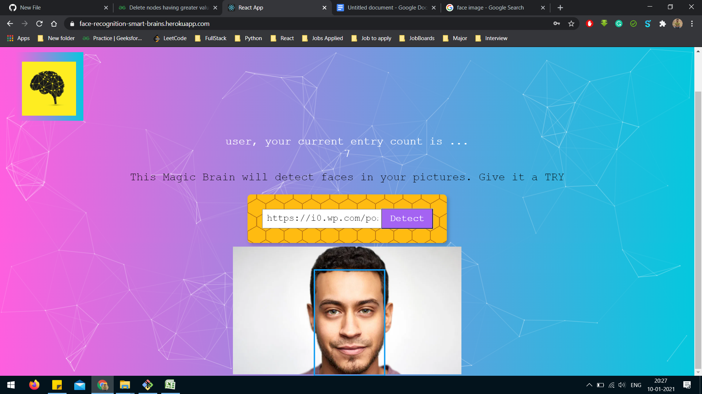
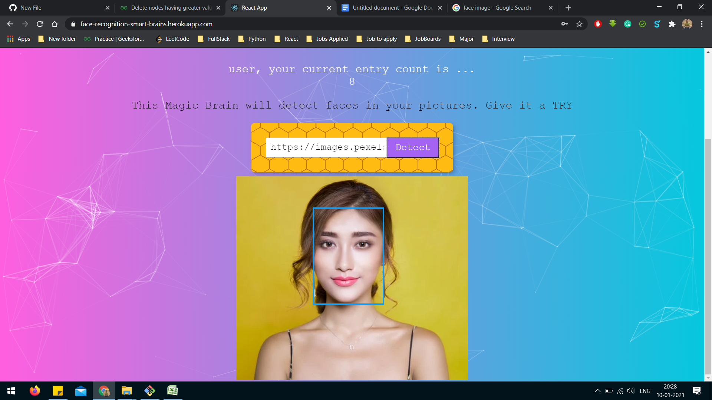
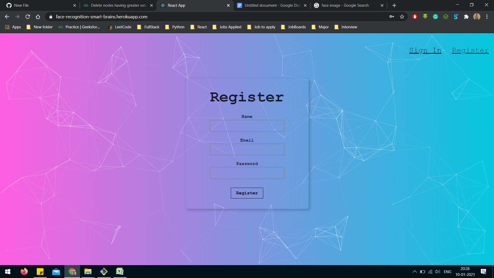
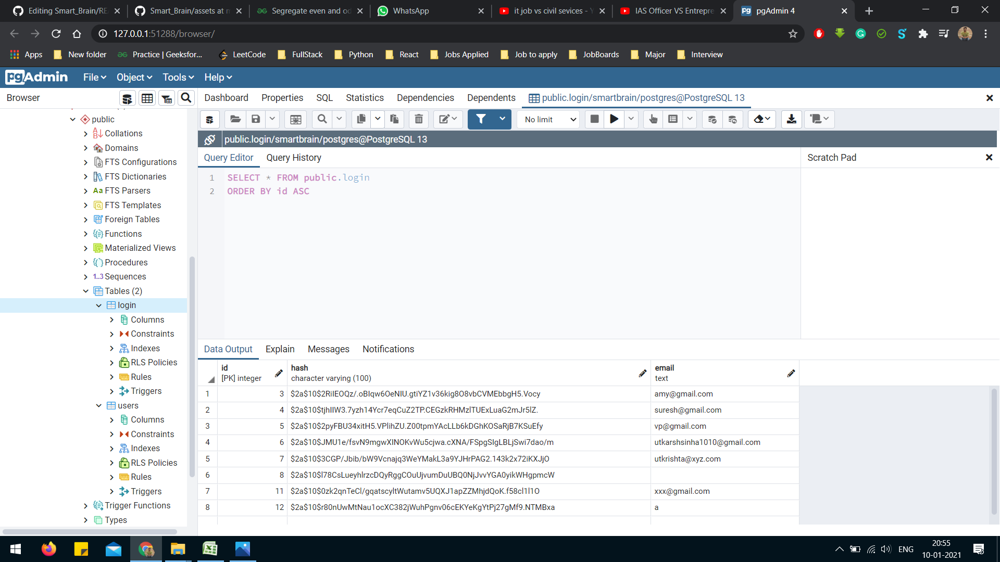
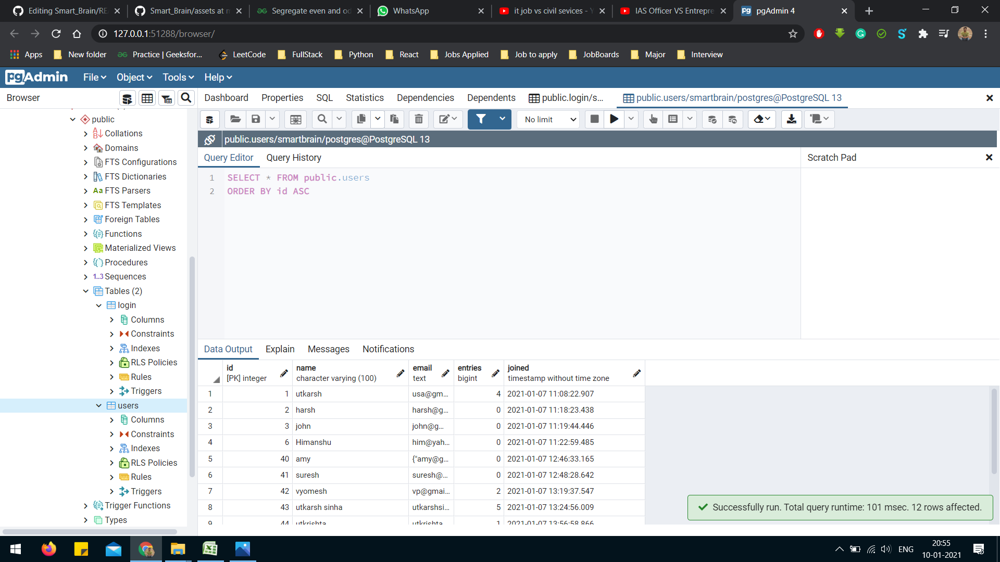

<h1>Smart Brain</h1>
<h2>Full Stack Web Application</h2>

<h3>Registration page</h3>
</img>
<h3>Sign-In page</h3>
</img>
<h3>Signing in with email:"user@gmail.com" and password:"user"</h3>
</img>
<h3>User pofile page with smart brain logo, sign out button, search box for image address, counts of faces till now</h3>
</img>
<h3>After a face is detected using Clarifai api call, increment of entry count increases</h3>
</img>
<h3>After a face is detected using Clarifai api call, increment of entry count increases</h3>
</img>
<h3>Signing out</h3>
</img>
<h3>Login table with attributes id, hash (for encryption), login id</h3>
</img>
<h3>Users table with attributes id, name, email, entries, joined date-time</h3>
</img>

